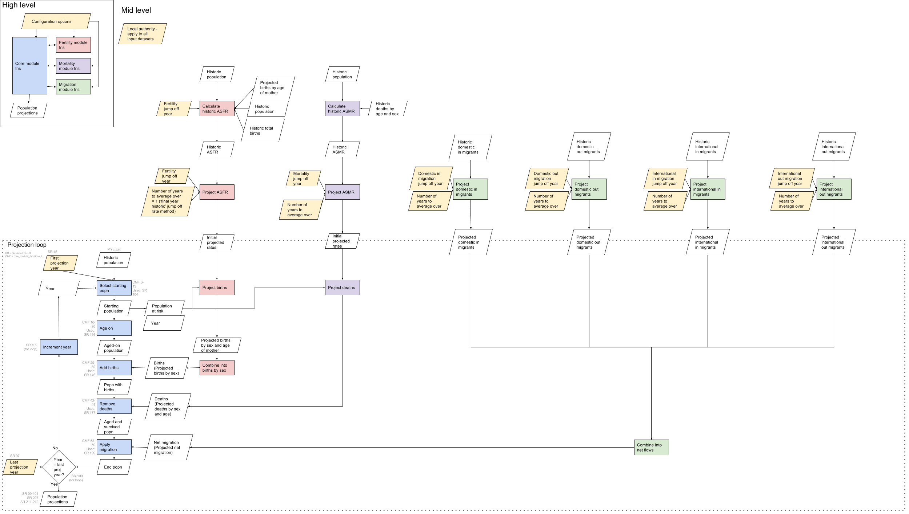
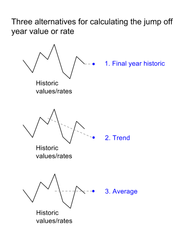

# Introduction to witan.models.demography

`witan.models.demography` is a Clojure library to run demographic models, which may include:

* Population projections
* Small area projections

The aim of `witan.models.demography` is to offer "generic" models in the sense that our models will be adaptable to different methodologies and data inputs.

Current status:
* Population projections: First release of a minimal version coming soon!
* Small area projections: Not started. Waiting to finish the population projections.

Note: The small area projections take as an input population projections.

## Glossary
Let's define a few terms and acronyms we use throughout the library:

* CCM: Cohort Component Model/Method

* jumpoff year: the first year of projection

* base year: the last year of historical data used

## Content of the library
* [Population projections](#population-projections)
  - [Trend-based Cohort Component Model](#trend-based-cohort-component-model)

	* Fertility component module

	* Mortality component module

	* Migration component module

    * Core projection module

  - [Housing-led Cohort Component Model](#housing-led-cohort-component-model)
  - [Employment-led Cohort Component Model](#employment-led-cohort-component-model)

* [Small area projections](#small-area-projections)

## Population projections

We have chosen to implement the cohort component method as it is the most commonly used method for generating population projections.

Alternative methods aren't currently supported in `witan.models.demography`.

<pre>Cohort component population projection:

This method begins with a starting population categorised by age and sex.
For each yearly iteration of the model, the population is projected by applying assumptions regarding mortality, fertility and migration.
This procedure gives, for every year of projection, a distribution of the population by age and sex. [1]

The ideas behind this method can be represented as an equation:

P(t+n)= P(t) + B(t) − D(t) + I(t) − E(t)

where:
    P(t) is the population at time t
    B(t) and D(t) are number of births and deaths occurring between t and t+n.
    I(t) and E(t) are the number of immigrants and of emigrants from the area
    during the period t to t+n.

[2]
</pre>

### Trend-based Cohort Component Model

This method involves projecting births, deaths and migrations by age and sex.

See below the minimal cohort component method we aim to provide:

Note:

We will ultimately provide four alternatives for projecting the components of change (i.e. fertiliy, mortality and migration): projected values or rates can either be fixed, or determined by applying a national trend.
See below:

For estimating the value or rate for the first year of projection (jump-off year or base year), we will provide three alternatives. See below:

1) Fertility

The standard methodology for birth projections relies on applying age-specific fertility rates (ASFR)
to the female population and splitting the estimated births into male and female using a standard ratio.

2) Mortality

3) Migration

### Housing-led Cohort Component Model

### Employment-led Cohort Component Model

 

## Small area projections

### Area proportional distribution

### Small area projection model

___
1. S. Pennec, 2009, [APPSIM - Cohort Component Population Projections to Validate and Align the Dynamic Microsimulation Model APPSIM](http://www.natsem.canberra.edu.au/publications/?publication=appsim-cohort-component-population-projections-to-validate-and-align-the-dynamic-microsimulation-model-appsim)
2. United Nations Population Fund (UNFPA), Population Analysis for Policies & Programmes, [concepts and methods](http://papp.iussp.org/sessions/papp101_s10/PAPP101_s10_060_010.html)
