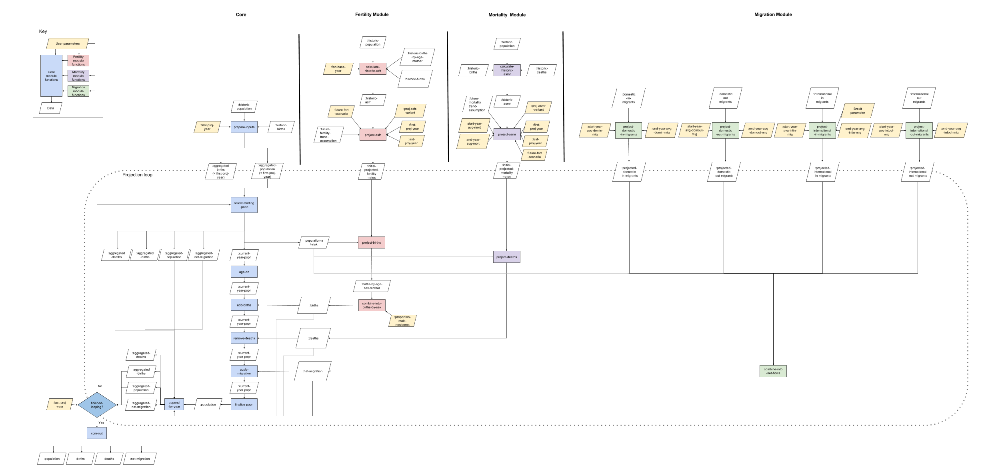
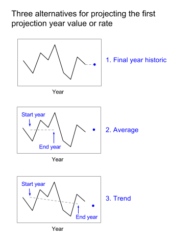
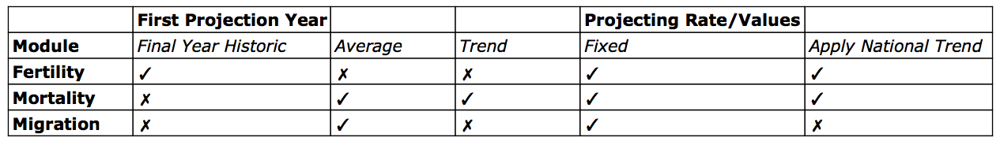

# Introduction to witan.models.demography

`witan.models.demography` is a Clojure library to run demographic models, which currently only includes:

* Population projections

The aim of `witan.models.demography` is to offer "generic" models in the sense that our models will be adaptable to different methodologies and data inputs. To learn more about the methodology, see the [modelling](#trend-based-cohort-component-model) section. To learn more about the data inputs currently being used, jump to the [data inputs](#data-inputs) section.

## Glossary
Let's define a few terms and acronyms we use throughout the library:

* CCM: Cohort Component Model/Method

* first projection year: the first year to be projected

* base year: the last year of historical data used

* Component of change: one of three calculations (mortality, fertility and migration), used to project the overall population projection.

## Content of the library
* [Population projections](#population-projections)
  - [Cohort Component Model](#cohort-component-model)

	* [Fertility component module](#fertility)

	* [Mortality component module](#mortality)

	* [Migration component module](#migration)

    * [Core projection module](#core)

## Population projections

We have chosen to implement the cohort component method as it is the most commonly used method for generating population projections.

Alternative methods aren't currently supported in `witan.models.demography`.

<pre>Cohort component population projection:

This method begins with a starting population categorised by age and sex.
For each yearly iteration of the model, the population is projected by applying assumptions regarding mortality, fertility and migration.
This procedure gives, for every year of projection, a distribution of the population by age and sex. [1]

The ideas behind this method can be represented as an equation:

P(t+n)= P(t) + B(t) − D(t) + I(t) − E(t)

where:
    P(t) is the population at time t
    B(t) and D(t) are number of births and deaths occurring between t and t+n.
    I(t) and E(t) are the number of immigrants and of emigrants from the area
    during the period t to t+n.

[2]
</pre>

### Cohort Component Model

This flowchart shows the steps of the Cohort Component Model that occur within the core module and draw on the fertility, mortality and migration modules':

(Please download the image for a more detailed overview of the model)

### Fertility

The standard methodology for birth projections relies on applying age-specific fertility rates (ASFR) to the female population and splitting the estimated births into male and female using a standard ratio.

### Mortality

Death projections are calculated by applying a set of age and sex specific mortality rates (ASMR) to the population' (note 'A single rate for deaths per sex and age group is applied across all years' is used when the fixed projection method is used)

### Migration

The net migration projections are calculated based on historic movement of both domestic and international migrants. Migrants are further characterised as either in- or out-migrants, combining this information to project the
net-migration.

### Core
The core module takes historic population data as well as projections from each of the components of change (above) to calculate the  population for each projected year.

## Methodologies for projecting components of change

Births, deaths and migrant projections are calculated by
1. projection of historic values
2. projection of historic rates which are then multiplied by a population at risk within the model.

There are 3 methods associated with calculating projections the first projection year:

...and 4 methods associated with calculating projections in further projection years:

Note:

Displayed below are the current options available for each component of change in regard to specific methodologies.

## User-defined parameters for the model

Some parameters in the model can be specified by the user. The parameters, with defaults in parentheses, are:

* First year of projection (2015)
* Last year of projection (2018)
* Start & end years of year range to average over when projecting deaths (2010-2014)
* Start & end years of year range to average over when projecting domestic in-migrants; migration into an area (2003-2014)
* Start & end years of year range to average over when projecting domestic out-migrants; migration out of an area (2003-2014)
* Start & end years of year range to average over when projecting international in-migrants; migration into an area (2003-2014)
* Start & end years of year range to average over when projecting international out-migrants; migration out of area (2003-2014)
* Proportion of male newborns, represented as a number of male newborns (105) and a number of all newborns (205). **IMPORTANT**: This proportion is set to 105/205 for the UK, and should only be changed for other countries.

## User-defined parameters for the geography

The geographical area for the projection must be specified. This is done with the 9-digit GSS code (Government Statistical Service code), or name, of one of the following:

  * an English unitary authority (starts with "E06")
  * an English non-metropolitan district (starts with "E07")
  * an English metropolitan borough (starts with "E08")
  * a London borough (starts with "E09")

## Data inputs

The historical data required for the projection comes from the UK's Office of National Statistics. The datasets used are:

* Historic population
* Projections of births by age of mother
* Historic births
* Historic deaths
* Domestic in-migrants
* Domestic out-migrants
* International in-migrants
* International out-migrants

Further information regarding these data inputs can be found [here](https://github.com/MastodonC/witan.models.demography/blob/feature/add-data-input-info/doc/Data_sources.csv)

 

___
1. S. Pennec, 2009, [APPSIM - Cohort Component Population Projections to Validate and Align the Dynamic Microsimulation Model APPSIM](http://www.natsem.canberra.edu.au/publications/?publication=appsim-cohort-component-population-projections-to-validate-and-align-the-dynamic-microsimulation-model-appsim)
2. United Nations Population Fund (UNFPA), Population Analysis for Policies & Programmes, [concepts and methods](http://papp.iussp.org/sessions/papp101_s10/PAPP101_s10_060_010.html)
